Hello all. I would like to explain the basics of working with git and our repository to everyone so that we can all work effectively. You can all read this when you get a chance, no hurry, but make sure you understand the basics of git before committing. If you have any questions at any point during the semester (or even later), you can always ask me. I’m not sure how specific to be, so I’ll try to cover everything that you might have to do (please don’t hurt me if anything I say is too basic, or not basic enough :p).

# Git
First, I would highly recommend reading at least chapter 2.1-2.5 of [the git-scm manual](https://git-scm.com/book/en/v2/Git-Basics-Getting-a-Git-Repository) at some point. However, I understand you guys have a lot of projects going on right now, so I’ll explain the basics of working with our repo.

## The command line
Most of the instructions I give will be on the command line. You can also work with git from within VSCode or other IDEs, but these have special instructions, and you might still need to do some things on the command line. If you use windows, you can download and use [git bash](https://gitforwindows.org), and if you use UNIX (macOS or linux) you can open the `terminal`  program on your computer.

## Forking
To make changes to my git repo (repository), you need to request that certain changes happen with a _pull request_, or PR. To make the changes that will be in a PR, you need to make a _fork_. A fork is a copy of someone else’s repository that belongs to you, so you can make changes to it. To make a fork,  hit the fork button at the top left of the repository page on GitHub.

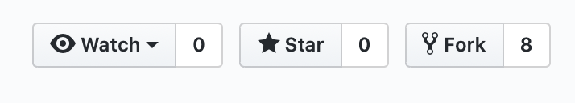

## Cloning
To work with a git repo, first you need to clone it. You can do this using HTTP or SSH, but if you don’t know what SSH is, you should probably use HTTP. The difference between these two methods is that SSH requires a little bit of setup, but HTTP requires putting in your password every time, and it won’t work if you have 2-factor auth enabled on your GitHub account. If you want help setting up SSH, let me know, and I’ll tell you how to set it up.  There is also a [GitHub Help](https://help.github.com/en/github/authenticating-to-github/connecting-to-github-with-ssh) page about it.  To clone a repo using HTTP, type `git clone` and copy and paste the “Clone with HTTP” URL from the repository (or type `https://{username}/{repo_name}.git`).

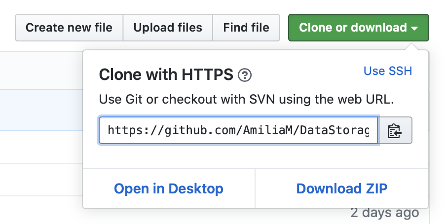

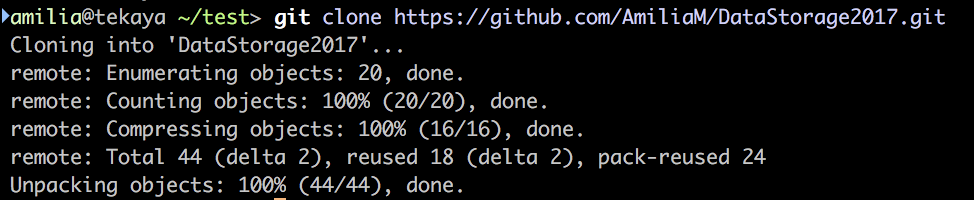

## Remotes
Next you need to configure your remotes. For more information about remotes, read chapter 2.5 in the git-scm manual. In short, they tell git where to look for other versions of your project (such as the repo you forked yours from). `cd` to the directory you cloned your repo to, and type `git remote -v` to see your remotes. Then, type `git remote add upstream` and the HTTP cloning URL that you forked your repo from. Then, you can do `git remote -v` again to see the changes.

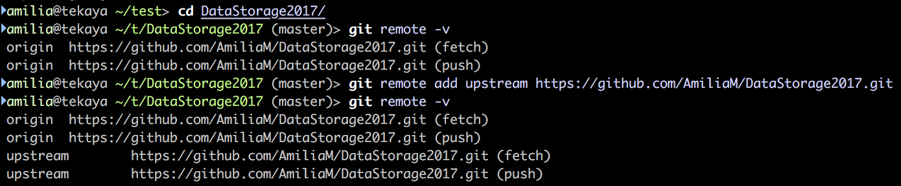

## Branches
Next, you should make a branch for the changes you are going to make. Generally, one PR should be atomic. In other words, they should make only one change, or add only one feature. This keeps the changes small and easy to review. The smaller your PR’s _diff_ (the amount of lines you change) is, the faster the changes can be accepted. The branch name should be relatively short, describe the feature or change, be all lowercase, and be hyphen-serarated. I want to add “hello, world!” to the bottom of the README, so I will name my branch `hello-world`.  To make a branch and switch to it, use `git checkout -b {branch-name}`. You can now make the changes that you want to see in the upstream repo. I am going to put “hello, world!” at the end of the README.

## Adding
You can use `git status` to check the status of a git repo at any time.

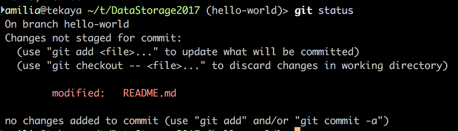

I’ve made some changes, but I can’t commit yet. First, I have to _stage_ my changes, using `git add`. As git says in the above screenshot, I could use `git add README.md` to stage my changes. If you have multiple changes, you can stage them by using `git add file1.py file2.py`. You can also use `git add .`, where `.` refers to your current directory. This will stage all changes. Be careful when staging many changes at a time in this fashion, as you can easily commit something you don’t mean to (including something containing sensitive personal information, or large files that can cause problems if pushed). To see what you might commit using `git add`, pass the `-n` flag to it.

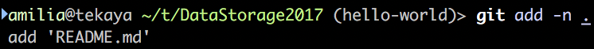

Using `git add .` here will stage `README.md`. That’s what we intended to change, so let’s add it.

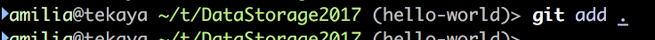

### What not to add
`git add .` won’t add things that are specified in the `.gitignore`. The types of files specified in there should never be added to the git repository, for various reasons. If you have a configuration file containing a secret key for your application, you should never commit that, as it can cause security issues for the server running it. You also shouldn’t commit files that are generated through building your code. For Java, that can be .class or .jar files. For python, .pyc or .pyo files (these are in the `__pycache__ `directory). If you have an application that puts user data into a database, that (the pg_dump for postgres or the .db file for sqlite) shouldn’t be committed for both of the reasons here. Not only can this expose private user information, but this is a generated file that is non-essential to the nature of the application.

Now that we have staged our changes, we can commit them. First, we should do `git status` again.

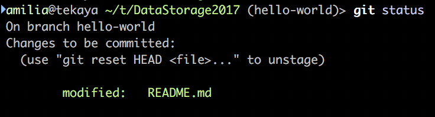

## Committing
Now, if I commit, it will add this change to the `hello-world` branch. You can commit with `git commit -m “commit message”`. The commit message should be a brief explanation of the changes you made, in a human readable form, capitalized properly, in imperative (present) tense. For example, a commit message should say “Update sorting method for queuing”, not “update sorting method for queuing”, “Updated the way queuing.py sorts items”, “I changed the sorting method for queuing so that it sorts things faster”, or “change-sorting-method”. This is just a best practice, and isn’t crucial to adhere to. However, it can help people understand what your commit does at a glance, and makes things consistent.

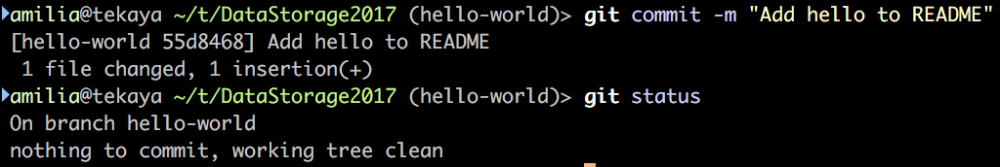

`git status` shows us that there are no remaining local changes from the repository (now the repo has the same thing as the files on our computer). However, if we go to the GitHub website, there are no changes there. Before we can see our changes, we need to push.

## Pushing
Pushing lets the remote repo (shown when we do `git remote -v`) know the changes that we have made. Use `git push` to push your changes.

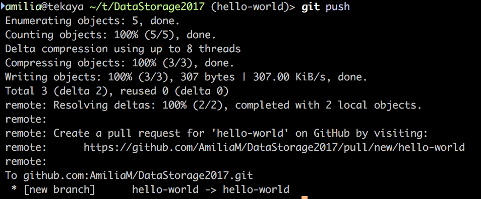

Most of this output isn’t terribly important, but note the link telling you how to create a PR. Follow  the link and make a pull request.

## Pull Requests
What you see will look somewhat like this:

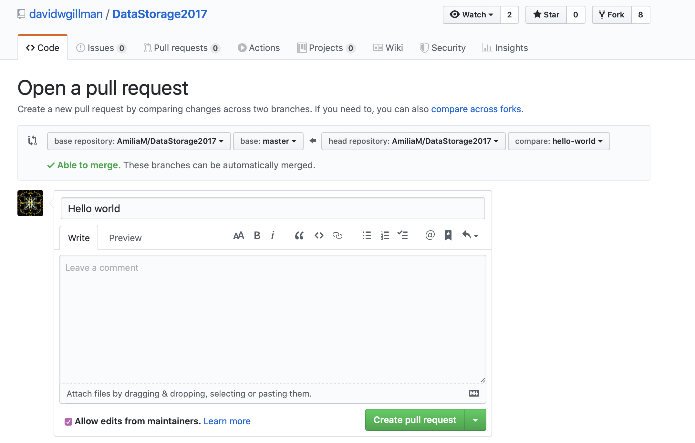

I want to open a PR to my own repository, not Gillman’s, so I select my repo from the leftmost dropdown. The rest of the options are fine. The title defaults to a human readable version of your branch name. That’s generally fine, but you can change it if you want. The body should contain a more detailed description of the changes you made, why you made them, and what issue numbers it resolves, if any (we probably won’t be using the GitHub issues system, as we will probably be using Trello as our internal feature/issue tracker, but many open source projects do, so it’s good to know about). Write some stuff, check the diff to make sure you changed the right thing, leave the allow maintainer edits checkbox checked, and click “Create pull request”.

You will then see your open PR, and see the checks start to run. If they succeed, good. I will review the PR  within 24 hours. If I don’t, the universe gives you the right to pester me repeatedly. Hopefully that won’t be a problem, but if it is, we can work something out. I will either request changes or merge it. Once the PR is merged, you can see the changes in the code and on the website.

### Failing checks
If the checks don’t succeed, usually you should try to fix the issue. If pylint failed, for example, because there is no trailing newline, you should edit the file (make sure you are still on the same branch), and add a newline. Add the file, then, you should amend your commit. You do this with
`git commit --amend`. An editor (usually vim) will open, showing the commit message. The same message is fine, so you should type the characters `:q` and hit enter to exit. Then, you should push. Because you amended your commit, git will give an error if you try to use `git push`. This is because there is a conflict between what the repo thinks the commit should contain and what your local branch thinks it should contain. Resolve this by using `git push -f`. This is a force push. Be very careful when force pushing, as you can delete your entire commit, branch, or even repository. It can also cause other people a big headache if they are working on the branch you force pushed. Never force push a branch other people have been working on unless you are certain it is okay. Force pushing is fine in this context because nobody else is working on your PR, and you can’t push directly to someone else’s repository without the proper settings enabled. If you don’t feel comfortable force pushing, you can always add another commit like above (change the file, `git add .`, `git commit -m “message”`, `git push`).

## Next Steps
Once you have finished working on your branch, you should be sure to switch back to the master branch with `git checkout master` so you don't accidentally commit to the wrong place. Then, you can make more changes, add, commit, push, make a PR, rinse and repeat.

Once a PR has been merged or another change has been made to the `master` branch of the repository (where PRs are merged to, and what the website runs off of), you can view those changes in your local repository by switching to that branch and doing `git pull` to fetch all the changes and apply them to your local files. It is important to do this every once in a while so you can make sure that your changes affect the most up to date code.

# Repository Structure
The repo may seem complicated and imposing at first, but don’t worry about understanding every file.

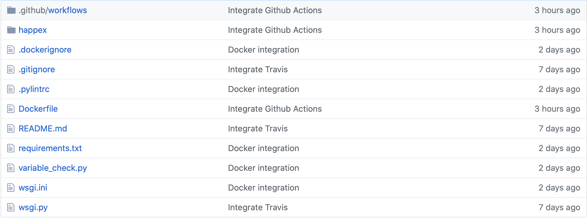

The .github folder stores .yml files that tell GitHub actions what to do on pull requests and pushes (I decided to use this instead of Travis). These do things like run pylint and deploy to my server. `happex/` is where you will probably be putting most of your code. `main.py` contains all of the routes the app responds to. At the moment, it responds with “hello world” to any request to ‘/‘ (the root of the app URL). `.dockerignore` is a file used by Docker to run properly. It’s not important to understand, but it is similar to the `.gitignore`, which tells git not to list in `git status` or add with `git add`. The .pylintrc is a configuration file for pylint. The Dockerfile is a list of instructions that tell Docker how to build the image. The README.md is what you see on the homepage of the repository. It tells people about your project. `requirements.txt` is used by pip to install the right requirements. Put things in here if you need them to be `pip install`ed to run the project. `variable_check.py` is a file I made a while ago that makes pylint have some custom behavior. You don’t really need to understand this either, pylint will use it automatically. wigs.ini and .py are files that an application called uwsgi uses to properly run python on a webserver. This also isn’t important to understand, and probably won’t be changed.